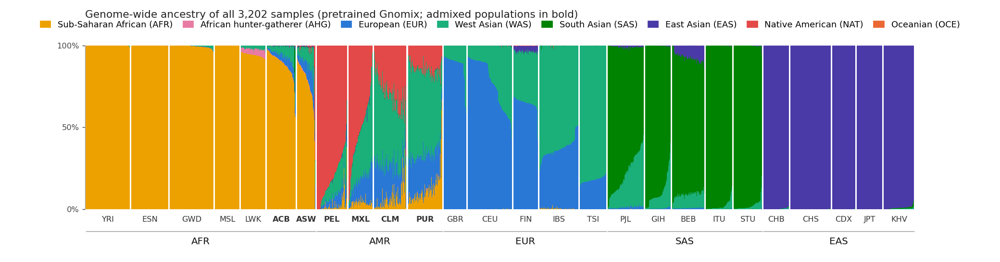
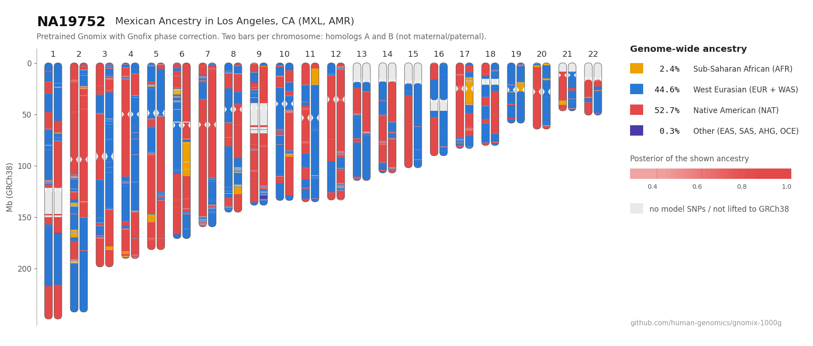
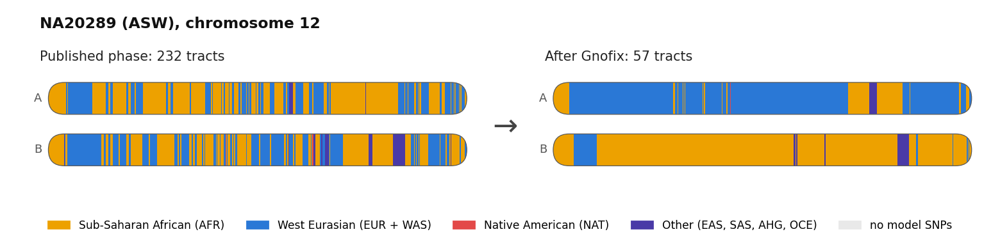
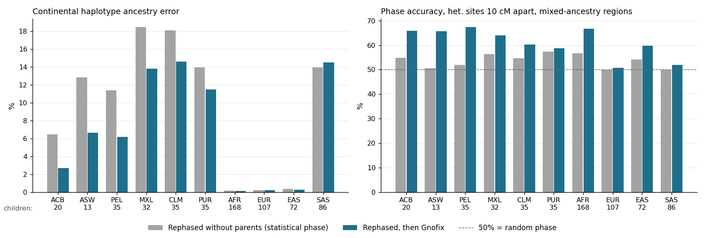
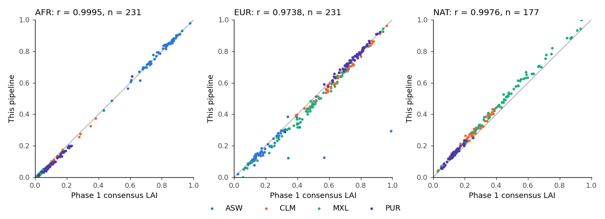

# gnomix-1000g: local ancestry for all 3,202 high-coverage 1000 Genomes samples

The published pretrained [Gnomix](https://github.com/AI-sandbox/gnomix) model, with Gnofix phase correction where it helps, on every sample of the 1000 Genomes high-coverage panel ([Byrska-Bishop et al. 2022](https://doi.org/10.1016/j.cell.2022.08.004)). One command, in Docker or locally, with public data only.

- **Output:** ancestry tracts per haplotype (GRCh38 and GRCh37), Gnomix `.msp` files, global ancestry, a karyogram for each sample, and a phase-corrected PLINK 2 panel.
- **Model:** pretrained Gnomix with 8 ancestries. After liftover to GRCh38, 22.1 M of its 23.2 M SNPs (95.5%) are in the panel.
- **Phase correction:** Gnofix re-orders haplotype segments so that ancestry is continuous along each haplotype. A benchmark on 603 trio children shows where this helps: all six admixed populations (ACB, ASW, CLM, MXL, PEL, PUR). Tracts, karyograms and the phase-corrected panel all use the same haplotypes.
- **Validation:** compared with Martin et al. (2017) and the 1000 Genomes Phase 1 local ancestry: global ancestry r = 0.97-1.00, diploid local ancestry agreement 84-90%.

**[Browse every sample's karyogram](https://human-genomics.github.io/gnomix-1000g/)** — select a superpopulation and population to see global ancestry, trio/duo relationships and Gnofix status. Hide trios if needed, switch between light and dark themes, and open any sample to view its karyogram alongside its relatives. The table combines European and West Asian ancestry as Western Eurasian (EUR + WAS); values below 0.2% are omitted.

Karyograms in the style of [ancestry_pipeline](https://github.com/armartin/ancestry_pipeline) (Martin et al. 2017).





More: [HG01893 (PEL; Martin et al. 2017, Fig. 1)](docs/karyogram_PEL_HG01893.png), [NA20412 (ASW)](docs/karyogram_ASW_NA20412.png), [HG01089 (PUR)](docs/karyogram_PUR_HG01089.png).

Gnofix on NA20289 (ASW), a sample it changed more than average: phase switch errors cut the ancestry tracts into pieces; Gnofix joins them (chromosome 12: 232 → 57 tracts).



## Download the outputs (no run needed)

The outputs are attached to the [v1.0.0 release](https://github.com/human-genomics/gnomix-1000g/releases/tag/v1.0.0).

| Asset | Size | Content |
|---|---:|---|
| `tracts_final.tsv.gz` | 93 MB | Ancestry tracts, final calls (format below) |
| `tracts_raw.tsv.gz`, `tracts_gnofix.tsv.gz` | 159 MB | Tracts without and with Gnofix, all samples |
| `global_ancestry.tar.gz` | 407 kB | Global ancestry per sample and population |
| `karyograms.zip` | 467 MB | One karyogram per sample (PNG) |
| `bed_hg38.tar.gz` | 104 MB | Tracts as BED files per haplotype (ancestry_pipeline format) |
| `msp.tar` | 43 MB | Gnomix `.msp` files and window tables |
| `posteriors.tar` | 198 MB | Posterior per haplotype, window and ancestry |
| `chrN_gnofix.{pgen.zst,pvar.zst,psam}` | 4.0 GB | Phase-corrected panel, 66 files |
| `pfile_swaps.tsv.gz`, `pfile_verification.json` | 655 kB | Where the panel phase was changed; read-back check |
| `gnofix_switches.tsv.gz` | 15 MB | Gnofix switch points, all samples |
| `validation.tar.gz`, `REPORT.md` | 202 kB | Benchmark, comparisons, report |
| `SHA256SUMS` | 7 kB | Checksums |

```bash
curl -fsSLO https://github.com/human-genomics/gnomix-1000g/releases/download/v1.0.0/SHA256SUMS
curl -fsSLO https://github.com/human-genomics/gnomix-1000g/releases/download/v1.0.0/tracts_final.tsv.gz
sha256sum -c --ignore-missing SHA256SUMS
```

## Run it

### Docker (recommended)

```bash
git clone https://github.com/human-genomics/gnomix-1000g.git && cd gnomix-1000g
docker build -t gnomix-1000g .
mkdir -p gnomix-1000g-data   # make it yourself, else root owns it
docker run --rm --user "$(id -u):$(id -g)" -e THREADS=16 -v "$(pwd)/gnomix-1000g-data:/data" gnomix-1000g
```

- Results: `gnomix-1000g-data/output/`. Start with `output/REPORT.md`.
- An interrupted run continues where it stopped.
- One step only: `docker run ... gnomix-1000g <step>`. Steps in order: `prepare`, `infer`, `trio`, `tracts`, `karyograms`, `compare`, `pfile`, `report`; `release` packages the outputs as release assets.

### Local (Linux x86_64)

```bash
THREADS=16 bash main.sh
```

Needs only `bash` and `curl`. Uses `python3.9` or `python3.10` if present; otherwise installs Python 3.9 into `tools/`. Installs Java and the OpenMP runtime there too, if missing. On macOS, use Docker.

### Settings

| Variable | Default | Meaning |
|---|---|---|
| `THREADS` | `4` | Worker processes. Each needs up to 2.5 GB RAM; fewer start if memory is short |
| `CHROMS` | `1-22` | Autosomes to run |
| `RUN_TRIO_BENCHMARK` | `0` | `0`: use the published Gnofix decision (`reference/gnofix_policy.json`). `1`: repeat the trio benchmark and use its decision |
| `TRIO_CHROMS` | `18-22` | Benchmark chromosomes |
| `MAKE_PFILE` | `1` | `0`: no phase-corrected panel |
| `REDRAW` | `0` | `1`: redraw all karyograms. They are redrawn automatically when the calls change |
| `GNOMIX1000G_DATA_DIR` | repository (`/data` in Docker) | Folder for `downloads/`, `work/`, `output/`, `logs/` |
| `BATCH_SIZE`, `TRIO_GROUPS`, `BEAGLE_MEM_GB` | `16`, `6`, `16` | Tuning |

## Output

### `output/tracts/tracts_final.tsv.gz`

One row per tract: a run of windows with the same ancestry on one haplotype.

| sample | haplotype | chrom | start_hg38 | end_hg38 | start_hg19 | end_hg19 | start_cM | end_cM | ancestry | n_windows | mean_posterior |
|---|---|---:|---:|---:|---:|---:|---:|---:|---|---:|---:|
| NA19752 | A | 1 | 13273 | 1162886 | 13273 | 1098266 | 0.000 | 2.739 | WAS | 4 | 0.669 |
| NA19752 | A | 1 | 1162978 | 1374911 | 1098358 | 1310291 | 2.739 | 3.030 | EUR | 2 | 0.596 |
| NA19752 | A | 1 | 1374980 | 1583013 | 1310360 | 1518393 | 3.030 | 3.248 | WAS | 2 | 0.596 |
| NA19752 | A | 1 | 1583061 | 4694257 | 1518441 | 4754317 | 3.248 | 11.363 | EUR | 27 | 0.685 |

- `haplotype`: `A` or `B`, the first or second allele of the phased genotypes (not maternal or paternal).
- `ancestry`: `AFR` (African), `AHG` (African hunter-gatherer), `EUR` (European), `WAS` (West Asian), `SAS` (South Asian), `EAS` (East Asian), `NAT` (Native American), `OCE` (Oceanian).
- Positions: first and last model SNP of the tract, 1-based. The model windows are defined in GRCh37. GRCh38 positions are lifted; `-1` where liftover reverses, stretches or reorders the windows.
- `tracts_final` uses Gnofix for ACB, ASW, CLM, MXL, PEL and PUR, except for trio and duo members (samples phased with a parent or child in the panel), which keep their published phase. `tracts_raw` (no Gnofix) and `tracts_gnofix` (Gnofix) give both versions for all samples.

### Other outputs

| File | Content |
|---|---|
| `global_ancestry_final.tsv` | Ancestry fractions per sample, diploid and per haplotype |
| `tracts/bed_hg38/<IID>_{A,B}.bed` | ancestry_pipeline format: `chrom spos epos ancestry sgpos egpos`; `UNK` where the posterior is < 0.9 |
| `msp/chrN.final.msp.gz` | Gnomix `.msp` format |
| `posteriors/chrN.final.npz` | Posterior per haplotype, window and ancestry (`uint8`, divide by 255) |
| `windows/chrN.windows.tsv` | Window positions (GRCh37, GRCh38, cM) and SNP counts |
| `karyograms/<POP>/<IID>.png` | One karyogram per sample |
| `pfile/chrN_gnofix.{pgen,pvar.zst,psam}` | All panel variants (chr1-22), phased as haplotypes A and B of `tracts_final` |
| `validation/` | Trio benchmark, comparisons, checks |
| `REPORT.md`, `MANIFEST.sha256` | Summary and checksums |

## Method

1. **Data.** The PLINK 2 release of the high-coverage panel ([cog-genomics.org](https://www.cog-genomics.org/plink/2.0/resources); 4 GB instead of 31 GB of VCFs). Its phased genotypes are the same as in the EBI VCFs.
2. **Model SNPs.** Each GRCh37 model SNP is lifted to GRCh38 and matched to a panel SNV by position and alleles: 95.5% are found (94.7-95.9% per chromosome).
3. **Absent SNPs get the reference allele.** Gnomix codes absent SNPs as `2`, and the pretrained models fail with it. Windows that agree with the calls on complete data:

   | Model SNPs removed (Gnomix demo data, chr22) | Coded `2` | Coded REF |
   |---|---:|---:|
   | The 5.3% absent from the panel | 11.9% | 100% |
   | Random 5% | 79.4% | 100% |
   | Random 20% | 44.7% | 99.9% |

4. **Inference.** Unmodified Gnomix (commit `cd15f65`) with the library versions the models were saved with (scikit-learn 1.0.1, xgboost 1.1.1), without and with Gnofix for every sample. Upstream Gnofix swaps the wrong SNPs on chr6, 7, 8, 19 and 21 (window remainder bug); we rebuild the corrected haplotypes from Gnofix's record of swapped windows.
5. **Where Gnofix is used.** Trio children were phased with their parents, so their phase is the truth. We remove it and phase each child again with Beagle 5.5 without its family ("rephased": the phase quality of an unrelated sample), on chr18-22. Gnofix is used for a population (≥ 10 trio children) if it lowers the continental haplotype ancestry error by ≥ 0.5 percentage points (paired one-sided Wilcoxon p < 0.01). Continental error: fraction of genetic length where a haplotype's call differs from the call on the true phase, after merging AFR + AHG → AFR and EUR + WAS → EUR.

## Validation

### Trio benchmark

603 trio children, chr18-22.

| Population | Children | Continental error, rephased | Rephased + Gnofix | p | Gnofix |
|---|---:|---:|---:|---:|---|
| ACB | 20 | 6.5% | 2.7% | < 0.0001 | yes |
| ASW | 13 | 12.8% | 6.6% | 0.0001 | yes |
| PEL | 35 | 11.4% | 6.2% | < 0.0001 | yes |
| MXL | 32 | 18.4% | 13.8% | 0.0004 | yes |
| CLM | 35 | 18.1% | 14.6% | < 0.0001 | yes |
| PUR | 35 | 13.9% | 11.5% | 0.0007 | yes |
| AFR, EUR, EAS (groups) | 347 | ≤ 0.4% | ≤ 0.3% | | no |
| SAS (group) | 86 | 13.9% | 14.5% | | no |

- **Phase without parents** (the phase of the ~1,900 unrelated samples): switch error rate 0.32-0.55% at the model SNPs. Heterozygous sites 1 cM apart are phased correctly 65-77% of the time; sites 10 cM apart 50-55% (50% = random).
- **Gnofix trades short-range for long-range phase.** It adds a few switch errors but improves phase over long distances, most where the two homologs (the two copies of a chromosome) carry different ancestries:

  | Population | Switch error rate | Phase accuracy, sites 1 cM apart | 10 cM apart | 10 cM apart, homologs of different ancestry |
  |---|---|---|---|---|
  | ACB | 0.32% → 0.33% | 78% → 78% | 52% → 55% | 55% → 66% |
  | ASW | 0.40% → 0.42% | 76% → 77% | 51% → 57% | 51% → 66% |
  | PEL | 0.47% → 0.49% | 66% → 67% | 51% → 56% | 52% → 67% |
  | MXL | 0.38% → 0.42% | 74% → 73% | 56% → 60% | 56% → 64% |
  | CLM | 0.27% → 0.33% | 83% → 77% | 56% → 58% | 55% → 60% |
  | PUR | 0.26% → 0.32% | 84% → 77% | 58% → 57% | 57% → 59% |

- **Gnofix on the true phase** adds 2 (AFR, EAS) to 124 (EUR) switches per child, because noisy EUR, WAS and SAS calls look like ancestry changes. Trio and duo members therefore keep their pedigree-based phase.
- **Reruns differ slightly.** Beagle's multithreaded phasing is not bit-identical between runs. An earlier run gave the same decisions except PUR (error 13.2% → 11.6%, p = 0.047). Gnofix lowered PUR's error in both runs; the table is the from-scratch Docker run.

Full table: `reference/trio_benchmark_summary.tsv`.



### Martin et al. (2017)

Martin et al. used RFMix and ADMIXTURE (K = 3) on the 2,504 Phase 3 samples. Their per-sample results are not public, so we compare with the paper's numbers (same samples; our ancestries merged to AFR, EUR and NAT).

| Population | Ancestry | Martin et al. (95% CI) | This pipeline (95% CI) |
|---|---|---|---|
| ACB | AFR | 0.88 (0.87-0.89) | 0.89 (0.88-0.91) |
| ASW | AFR | 0.76 (0.73-0.78) | 0.77 (0.73-0.81) |
| PEL | NAT | 0.77 (0.75-0.80) | 0.82 (0.79-0.85) |
| MXL | NAT | 0.47 (0.43-0.50) | 0.56 (0.50-0.61) |
| CLM | NAT | 0.26 (0.24-0.27) | 0.30 (0.28-0.33) |
| PUR | NAT | 0.13 (0.12-0.13) | 0.16 (0.15-0.16) |

- African ancestry agrees; Native American ancestry is 3-9 percentage points higher here.
- Samples named in the paper: NA20314 (ASW, "no African ancestry") has 0.3% AFR. HG01880 (ACB) and HG01944 (PEL), outliers with "South or East Asian ancestry", have 26% SAS and 36% EAS.
- A single-pulse estimate from tract lengths (continental labels, tracts > 2 cM) gives 19 generations since admixture for ACB and 16 for PEL; Martin et al. report 8 and 12. Tracts split by call noise bias our simple estimate upward (`validation/compare_martin2017_timing.tsv`).

### 1000 Genomes Phase 1 local ancestry

The Phase 1 admixture working group published per-sample tracts (consensus of LAMP-LD, HAPMIX, RFMix and MULTIMIX) for 242 ASW, CLM, MXL and PUR samples; 231 of them are in the high-coverage panel. Phase 1 ran ASW with AFR and EUR only, so NAT uses the 177 other samples.

| | AFR | EUR | NAT |
|---|---:|---:|---:|
| Samples | 231 | 231 | 177 |
| Global ancestry, Pearson r | 0.9995 | 0.9722 | 0.9959 |
| Mean, Phase 1 | 23.9% | 53.1% | 30.0% |
| Mean, this pipeline | 23.3% | 49.5% | 34.5% |
| Mean absolute difference per sample | 1.1 pp | 3.8 pp | 4.5 pp |

Diploid local ancestry (both homologs' calls, as a pair) agrees with Phase 1 for 88% (ASW), 88% (CLM), 84% (MXL), 90% (PUR) of the genetic length.



### Other checks

- **Official Gnomix path.** Nine 1000 Genomes samples of the Gnomix demo VCF (GRCh37, Phase 3 calls): same main ancestry for all nine; unphased genotypes agree at 99.8% of sites (`validation/official_path_concordance.tsv`).
- **Reproducibility.** A Docker run from an empty folder (fresh clone, image built without cache, all inputs downloaded) gave identical inference arrays to an earlier independent run on all 22 chromosomes. A local run on bare Ubuntu 24.04 (no Python or Java installed) completed all steps.
- **Phase-corrected panel.** Every variant is read back: unordered genotypes equal the source, and the phase equals the plan. `validation/verify_pfile.sh` repeats the check independently with plink2 and bcftools.

## Runtime and storage

From-scratch Docker run with `THREADS=28` on a 128-core machine shared with other jobs:

| Step | Wall time | CPU time |
|---|---:|---:|
| Download inputs (6 GB) | 4 min | |
| `prepare` | 4 min | < 1 h |
| `infer` | 4.1 h | 97 h |
| `trio` (published decision), `tracts`, `compare`, `report` | 11 min | < 1 h |
| `karyograms` | 26 min | 12 h |
| `pfile` | 34 min | 6 h |
| **Default run** | **5.4 h** | **≈ 116 h** |
| `RUN_TRIO_BENCHMARK=1` adds | 2.6 h | 52 h |

Inference scales with `THREADS` (about 6 h with 16). Storage: `downloads/` 6 GB, `work/` 17 GB, `output/` 11 GB. Memory: up to 2.5 GB per worker; `THREADS=28` ran within 70 GB.

## Limitations

- **EUR, WAS and SAS are close.** WAS rises from 12% (GBR) to 82% (TSI): it marks a southern European / Near Eastern axis, not West Asian admixture. Merge EUR and WAS for most uses; the karyograms of admixed populations do.
- **Training overlap.** The models were trained on 1000 Genomes, HGDP and SGDP individuals with ≥ 95% single ancestry, so many unrelated non-admixed 1000 Genomes samples were probably training references. Most admixed samples, and the 698 relatives added in 2020, were not.
- **Fixed windows** of about 0.2 cM: tracts of only a few windows are unreliable.
- **Accuracy of the 8-ancestry model** is not published. The paper's simulations give 93.3% (7 ancestries) and 97.8% (Latin American) window accuracy for this model type.

## Repository

| Path | Content |
|---|---|
| `main.sh`, `Dockerfile` | Entry points (local and Docker) |
| `download.sh`, `setup_tools.sh` | Data and tool downloads, SHA-256 checked |
| `gnomix1000g/` | Pipeline steps (one module per step) |
| `reference/` | Published Gnofix decision and benchmark, numbers from Martin et al. (2017) |
| `validation/verify_pfile.sh` | Independent check of the phase-corrected panel |
| `tests/` | Unit tests (`pytest`) |
| `docs/` | Figures used in this README |

## Data sources

| Input | Source |
|---|---|
| 1000 Genomes high-coverage phased panel (PLINK 2) | [cog-genomics.org/plink/2.0/resources](https://www.cog-genomics.org/plink/2.0/resources) |
| Pretrained Gnomix models | [AI-sandbox/gnomix](https://github.com/AI-sandbox/gnomix) (Google Drive link in its README) |
| Gnomix code | [AI-sandbox/gnomix](https://github.com/AI-sandbox/gnomix) @ `cd15f65` |
| Beagle 5.5 (`27Feb25.75f`) | [faculty.washington.edu/browning/beagle](https://faculty.washington.edu/browning/beagle/beagle.html) |
| hg19 → hg38 chain, hg38 cytobands | [UCSC](https://hgdownload.soe.ucsc.edu/) |
| Phase 1 local ancestry, Phase 3 sample panel | [1000 Genomes FTP](https://ftp.1000genomes.ebi.ac.uk/vol1/ftp/phase1/analysis_results/ancestry_deconvolution/) |
| Local mode only: Python 3.9, Java 17, OpenMP runtime | [python-build-standalone](https://github.com/astral-sh/python-build-standalone), [Adoptium Temurin](https://adoptium.net/), [conda-forge libgomp](https://anaconda.org/conda-forge/libgomp) |

All downloads are checked against SHA-256 (`download.sh`, `setup_tools.sh`, `main.sh`).

## Citations

- Martin AR, Gignoux CR, Walters RK, et al. Human demographic history impacts genetic risk prediction across diverse populations. *Am J Hum Genet* 100, 635-649 (2017).
- Hilmarsson H, Kumar AS, Barrabés M, et al. Scalable high resolution ancestry deconvolution for genomic data. *Nat Commun* 17, 9070 (2026).
- Byrska-Bishop M, Evani US, Zhao X, et al. High-coverage whole-genome sequencing of the expanded 1000 Genomes Project cohort including 602 trios. *Cell* 185, 3426-3440 (2022).
- The 1000 Genomes Project Consortium. An integrated map of genetic variation from 1,092 human genomes. *Nature* 491, 56-65 (2012).
- Browning BL, Tian X, Zhou Y, Browning SR. Fast two-stage phasing of large-scale sequence data. *Am J Hum Genet* 108, 1880-1890 (2021).
- Chang CC, Chow CC, Tellier LC, et al. Second-generation PLINK. *GigaScience* 4, 7 (2015).

## License

MIT for the code in this repository. Gnomix and its pretrained models are free for academic research use only (commercial use: Galatea Bio / Stanford OTL), and results made with them inherit that condition. Beagle is GPL-3.0. The pipeline downloads these; the repository does not contain them.
